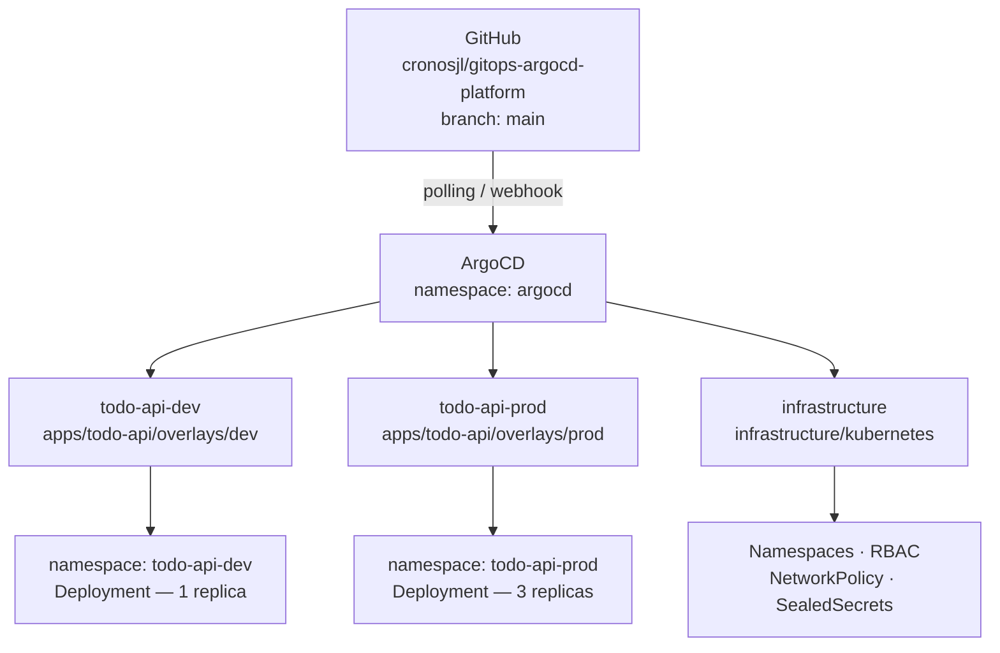
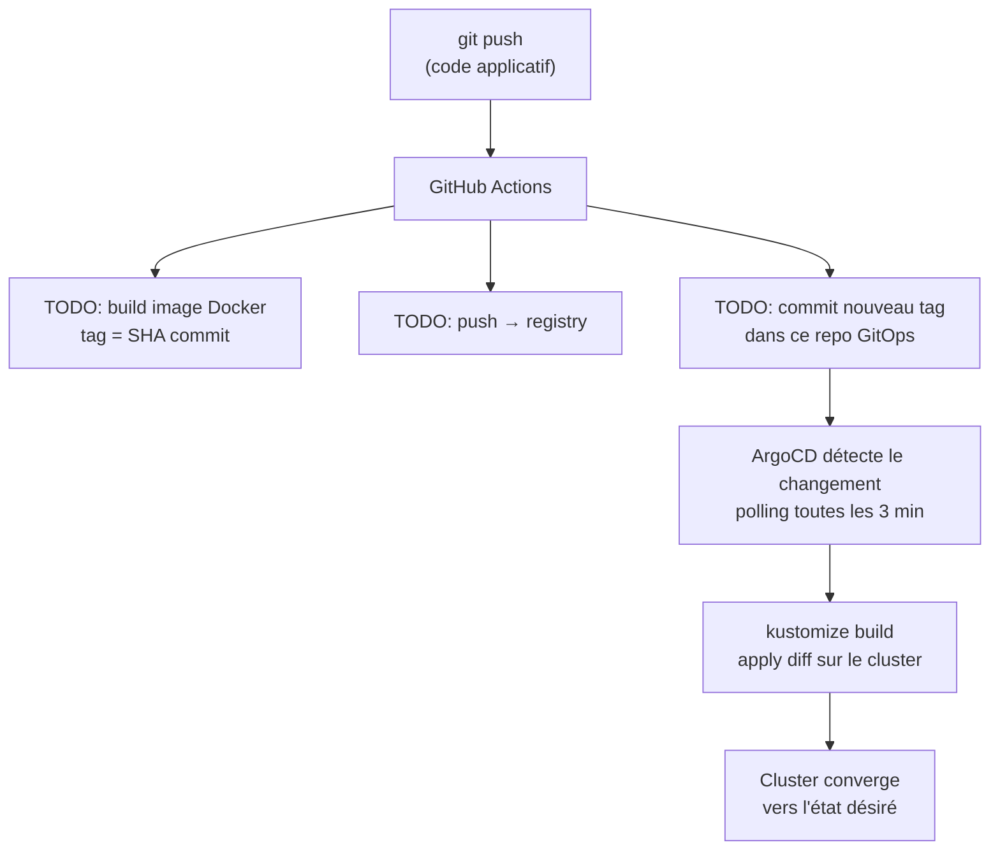
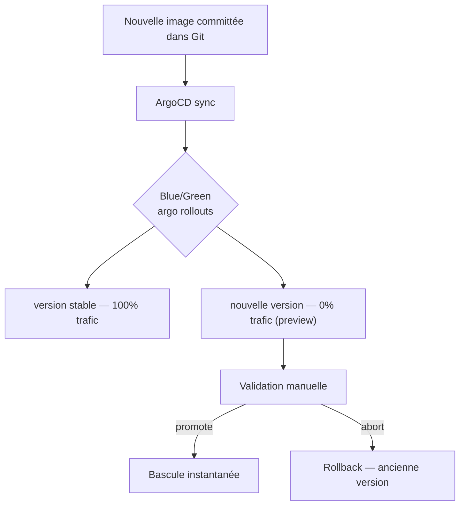

# GitOps ArgoCD Platform — Todo API

Projet fil rouge GitOps : déploiement d'une API REST sur Kubernetes avec ArgoCD et Kustomize.

**Team :** `argocd-platform`

---

## Sommaire

- [Vue d'ensemble](#vue-densemble)
- [Stack technique](#stack-technique)
- [Architecture](#architecture)
- [Structure du repo](#structure-du-repo)
- [Prérequis](#prérequis)
- [Démarrage rapide](#démarrage-rapide)
- [Environnements](#environnements)
- [Git Flow](#git-flow)
- [Pipeline CI/CD](#pipeline-cicd)
- [Déploiements progressifs](#déploiements-progressifs)
- [Infrastructure as Code](#infrastructure-as-code)
- [Sécurité](#sécurité)
- [Commandes utiles](#commandes-utiles)
- [Choix techniques](#choix-techniques-justifiés)

---

## Vue d'ensemble

Ce repo est le **repo GitOps** : il ne contient pas le code applicatif, mais tous les **manifests Kubernetes** nécessaires au déploiement de la todo-api. ArgoCD surveille ce repo en continu et synchronise l'état du cluster avec l'état Git.

```
Principe fondamental : Git est la source de vérité.
Toute modification de l'infrastructure passe par un commit.
```

### API Todo

| Endpoint     | Méthode | Description       |
|--------------|---------|-------------------|
| `/todos`     | GET     | Lister les todos  |
| `/todos`     | POST    | Créer un todo     |
| `/todos/:id` | DELETE  | Supprimer un todo |

**Image Docker :** `kennethreitz/httpbin`

---

## Stack technique

| Composant                | Choix                                           |
|--------------------------|-------------------------------------------------|
| Orchestration            | Kubernetes local via **minikube**               |
| GitOps                   | **ArgoCD** (auto-sync, prune, selfHeal)         |
| Packaging manifests      | **Kustomize** (base + overlays)                 |
| CI                       | **GitHub Actions**                              |
| Déploiements progressifs | **Argo Rollouts** (blue/green TODO, canary TODO) |
| IaC                      | Manifests K8s dans `infrastructure/kubernetes/` |
| Secrets                  | **Sealed Secrets**                              |

> Kustomize uniquement — pas de Helm dans ce repo.

---

## Architecture



### Flux CI → GitOps



---

## Structure du repo

```
gitops-argocd-platform/
├── apps/
│   └── todo-api/
│       ├── base/                        # Manifests de base (Deployment + Service)
│       │   ├── deployment.yaml
│       │   ├── service.yaml
│       │   └── kustomization.yaml
│       └── overlays/
│           ├── dev/                     # 1 replica — namespace todo-api-dev
│           │   ├── kustomization.yaml
│           │   └── patch-replicas.yaml
│           └── prod/                    # 3 replicas — namespace todo-api-prod
│               ├── kustomization.yaml
│               └── patch-replicas.yaml
├── argocd/
│   └── applications/                    # Application CRDs ArgoCD
│       ├── todo-api-dev.yaml
│       ├── todo-api-prod.yaml
│       └── infrastructure.yaml
├── infrastructure/
│   └── kubernetes/                      # IaC : namespaces, RBAC, NetworkPolicy
│       ├── kustomization.yaml
│       ├── namespaces.yaml
│       ├── rbac.yaml
│       ├── network-policy.yaml
│       └── sealed-secret.yaml
├── .github/
│   └── workflows/
│       └── deploy.yml                   # Pipeline CI (validation + build/push TODO)
├── README.md
└── TESTING.md
```

---

## Prérequis

| Outil       | Version min | Installation            |
|-------------|-------------|-------------------------|
| `minikube`  | 1.30+       | `brew install minikube` |
| `kubectl`   | 1.25+       | `brew install kubectl`  |
| `kustomize` | 5.0+        | `brew install kustomize`|
| `argocd`    | 2.8+        | `brew install argocd`   |
| `kubeseal`  | any         | `brew install kubeseal` |

```bash
minikube version && kubectl version --client && kustomize version
argocd version --client && kubeseal --version
```

---

## Démarrage rapide

### 1. Cloner le repo

```bash
git clone https://github.com/cronosjl/gitops-argocd-platform.git
cd gitops-argocd-platform
```

### 2. Démarrer le cluster minikube

```bash
minikube start --driver=docker

kubectl get nodes
```

### 3. Installer ArgoCD

```bash
kubectl create namespace argocd
kubectl apply -n argocd \
  -f https://raw.githubusercontent.com/argoproj/argo-cd/stable/manifests/install.yaml \
  --server-side

kubectl wait --for=condition=available --timeout=120s \
  deployment/argocd-server -n argocd
```

### 4. Installer Sealed Secrets

```bash
curl -sL https://github.com/bitnami-labs/sealed-secrets/releases/latest/download/controller.yaml | kubectl apply -f -
kubectl wait --for=condition=available --timeout=60s deployment/sealed-secrets-controller -n kube-system
```

### 5. Accéder à l'UI ArgoCD

```bash
kubectl port-forward svc/argocd-server -n argocd 8080:443 &

ARGOCD_PWD=$(kubectl -n argocd get secret argocd-initial-admin-secret \
  -o jsonpath="{.data.password}" | base64 -d)

argocd login localhost:8080 --insecure --username admin --password $ARGOCD_PWD
echo "UI → https://localhost:8080  (admin / $ARGOCD_PWD)"
```

### 6. Déployer les Applications ArgoCD

```bash
kubectl apply -f argocd/applications/ -n argocd
argocd app list
# Attendu : todo-api-dev, todo-api-prod, infrastructure — Synced + Healthy
```

ArgoCD synchronise automatiquement tous les environnements depuis `main`.

---

## Environnements

| Environnement | Namespace        | Replicas | Source                           | Type       |
|---------------|------------------|----------|----------------------------------|------------|
| dev           | `todo-api-dev`   | 1        | `apps/todo-api/overlays/dev`     | Deployment |
| prod          | `todo-api-prod`  | 3        | `apps/todo-api/overlays/prod`    | Deployment |

### Applications ArgoCD

| Application      | Source                           | Namespace cible  |
|------------------|----------------------------------|------------------|
| `todo-api-dev`   | `apps/todo-api/overlays/dev`     | `todo-api-dev`   |
| `todo-api-prod`  | `apps/todo-api/overlays/prod`    | `todo-api-prod`  |
| `infrastructure` | `infrastructure/kubernetes`      | `default`        |

Toutes configurées avec `prune: true` et `selfHeal: true`.

### Accès local

```bash
# Dev
kubectl port-forward svc/todo-api -n todo-api-dev 3000:80
# → http://localhost:3000

# Prod
kubectl port-forward svc/todo-api -n todo-api-prod 3001:80
# → http://localhost:3001
```

---

## Git Flow

```
main ───────────────────────────────────── (stable, ArgoCD pointe ici)
  │
  └─ develop ────────────────────────────── (intégration)
       │
       ├─ feature/<nom>  ──► PR ──► develop
       ├─ release/<ver>  ──► PR ──► main + back-merge develop
       └─ hotfix/<nom>   ──► PR ──► main + back-merge develop
```

### Règles

- Jamais de push direct sur `main` ou `develop` — toujours via PR
- Tout travail commence depuis `develop` (sauf `hotfix/*` depuis `main`)
- Pas de `git push --force` sur les branches permanentes

### Workflow feature

```bash
git checkout develop && git pull origin develop
git checkout -b feature/<description>
# ... travail ...
git push -u origin feature/<description>
# Ouvrir PR : feature/<nom> → develop
```

### Convention de commit

```
<type>(<scope>): <description courte>
```

| Type       | Scope exemples                    |
|------------|-----------------------------------|
| `feat`     | `kustomize`, `argocd`, `rollouts` |
| `fix`      | `argocd`, `ci`, `kubernetes`      |
| `chore`    | `ci`, `release`                   |
| `docs`     | *(pas de scope)*                  |
| `ci`       | `workflows`                       |
| `infra`    | `kubernetes`                      |
| `security` | `secrets`, `rbac`                 |

---

## Pipeline CI/CD

### État actuel

`.github/workflows/deploy.yml` : validation Kustomize uniquement.

### Cible

```yaml
on:
  push:
    branches: [main]

jobs:
  build-and-push:
    # Build image → tag = github.sha
    # Push → registry
    # kustomize edit set image → commit dans ce repo
    # ArgoCD détecte → sync automatique
```

**Secrets GitHub requis :**

| Secret            | Description                           |
|-------------------|---------------------------------------|
| `DOCKER_USERNAME` | Identifiant Docker Hub                |
| `DOCKER_PASSWORD` | Token Docker Hub                      |
| `GITOPS_TOKEN`    | PAT GitHub (write access sur ce repo) |

> La CI ne fait **jamais** `kubectl apply`. Elle commit uniquement le tag dans ce repo.

---

### Blue/Green (TODO)

Stratégie : deux versions tournent en parallèle. La bascule est manuelle et instantanée. Rollback en une commande.



### Canary (TODO)

Stratégie : montée en charge progressive — 10% → 50% → 100%, rollback automatique si métriques dégradées.

---

## Infrastructure as Code

Les ressources d'infrastructure sont dans `infrastructure/kubernetes/` et déployées par l'Application ArgoCD `infrastructure`.

| Fichier               | Contenu                             |
|-----------------------|-------------------------------------|
| `namespaces.yaml`     | Namespaces applicatifs              |
| `rbac.yaml`           | ServiceAccount, Role, RoleBinding   |
| `network-policy.yaml` | Isolation réseau entre namespaces   |
| `sealed-secret.yaml`  | Secrets chiffrés                    |

```bash
# Modifier l'infra
vim infrastructure/kubernetes/rbac.yaml
kustomize build infrastructure/kubernetes  # valider
git commit -m "infra(kubernetes): ..."
git push origin main                       # ArgoCD applique
```

---

## Sécurité

### Secrets — règle absolue

Jamais de valeur secrète en clair dans Git.

```bash
# Chiffrer un secret avec Sealed Secrets
kubectl create secret generic my-secret \
  --from-literal=password=valeur \
  --dry-run=client -o yaml | \
  kubeseal --format yaml > infrastructure/kubernetes/sealed-secret.yaml

# Audit : vérifier l'absence de secrets en clair
grep -r "password:\|token:\|secret:" apps/ argocd/ infrastructure/ \
  --include="*.yaml" \
  | grep -v "secretKeyRef\|sealed\|encryptedData"
# → doit retourner 0 ligne
```

### RBAC K8s

- `ServiceAccount` dédié par application
- `Role` minimal : lecture seule (pods, configmaps, secrets)
- Pas d'accès cross-namespace

### Network Policies

Chaque namespace a une `NetworkPolicy` bloquant tout trafic non autorisé explicitement.

---

## Commandes utiles

### Kustomize

```bash
kustomize build apps/todo-api/overlays/dev
kustomize build apps/todo-api/overlays/prod
kustomize build infrastructure/kubernetes
```

### ArgoCD

```bash
argocd app list
argocd app sync todo-api-dev
argocd app sync todo-api-prod
argocd app sync infrastructure
argocd app get todo-api-prod
```

### Cluster

```bash
kubectl -n todo-api-dev get deploy,po,svc
kubectl -n todo-api-prod get deploy,po,svc
kubectl -n todo-api-prod get events --sort-by='.lastTimestamp'
```

### Nettoyage

```bash
argocd app delete todo-api-dev todo-api-prod infrastructure --yes
kubectl delete ns todo-api-dev todo-api-prod
minikube stop
```

---

## Choix techniques justifiés

**Kustomize plutôt que Helm**
Kustomize est natif Kubernetes, sans moteur de templates supplémentaire. Il surcharge uniquement ce qui change par overlay (replicas, namespace, image tag) sans dupliquer les manifests de base.

**Blue/Green plutôt que Rolling Update**
La bascule est instantanée et 100% réversible : l'ancienne version reste active jusqu'à la promotion manuelle. Zéro downtime, rollback en une commande.

**ArgoCD pour le GitOps**
UI riche, gestion déclarative des Applications via CRDs, visibilité immédiate sur l'état de sync et les diffs Git vs cluster.

**Manifests K8s pour l'IaC**
Pour les ressources Kubernetes (namespaces, RBAC, NetworkPolicy), des manifests gérés par ArgoCD suffisent et évitent la complexité d'un Terraform Controller.

**Git Flow**
Sépare le travail en cours (`feature/*`) du code stable (`main`/`develop`), avec traçabilité via les PRs et historique Git propre pour le livrable.
